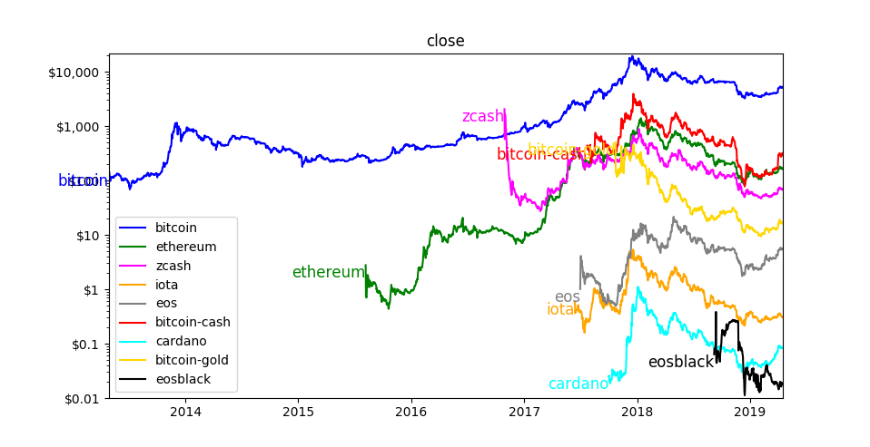

Cryptocurrency
==============

| Version: 0.0.17
| Released: 2019-04-17
|

Install using::

    pip3 install --user --upgrade .

Introduction
------------

This program reads a file containing transactions to determine the total number 
of cryptocurrency tokens that are held and reports on the current value of the 
portfolio.

The transactions are read from a file contained in ~/.config/cryptocurrency. The 
filename should be *transactions.gpg* or *transactions*.  The following in an 
example of a transactions file::

    from cryptocurrency import Account, BTC, ETH, BCH, ZEC

    zeus = Account('zeus')
    hermes = Account('hermes', False)
    persephone = Account('persephone', False)

    zeus.transaction(      BTC(5, 120),  '130905', 'initial purchase (coinbase)')
    zeus.transaction(      BCH(5),       '170801', 'fork of bitcoin')
    zeus.transaction(      BTC(-2),      '170917', 'convert to ether')
    zeus.transaction(      ETH(28.2276), '170917', 'convert from bitcoin')
    zeus.transaction(      BTC(-1),      '170930', 'Gift to Hermes')
    hermes.transaction(    BTC(1),       '170930', 'Gift from Zeus')
    zeus.transaction(      BTC(-1),      '170930', 'Gift to Persephone')
    persephone.transaction(BTC(1),       '170930', 'Gift from Zeus')
    zeus.transaction(      BTC(5, 5240), '171012', 'purchase (GDAX)')
    zeus.transaction(      ETH(-1),      '171123', 'Gift to Hermes')
    hermes.transaction(    ETH(1),       '171123', 'Gift from Zeus')
    zeus.transaction(      ETH(-1),      '171123', 'Gift to Persephone')
    persephone.transaction(ETH(1),       '171123', 'Gift from Zeus')
    zeus.transaction(      BCH(0.0005),  '170801', 'transaction fee')

Use *Account* to create an account that can hold a sequence of transactions.  
*Account* take an optional boolean second argument. It indicates whether the 
account should be included in the collection accounts that are displayed by 
default.

The first argument of transaction is the token involved in the transaction. For 
example, 'ETH(2, 400)', which signifies that 2 ether tokens were acquired for 
a cost of $400 each. Leave the cost out if it is a transfer rather than 
a purchase or sale. The second argument is the date, in the form YYMMDD.  The 
final argument is a comment.

In this transactions file, three accounts are created, one each for Zeus, 
Hermes, and Persephone. Once defined, transactions are associated with the three 
accounts.

When running the cryptocurrency program, you can request information about each 
of the accounts individually or as a group. For example::

    cryptocurrency       -- show summary of default accounts without transactions
    cryptocurrency -t    -- show summary of default accounts with transactions
    cryptocurrency zeus  -- show summary of zeus account without transactions
    cryptocurrency hermes persephone
                         -- show summary of hermes and persephone accounts
    cryptocurrency -t hermes persephone
                         -- same with transactions

    cryptocurrency -p    -- show current prices rather than holdings

You can also override the current price of cryptocurrencies to examine what-if 
scenarios.  Any account specified that contains an '=' is taken to be an 
override rather than an account name, and must be specified as a name=value 
pair, where name is the name of the currency and value is its value in US 
dollars.  For example::

    cryptocurrency BTC=100k
    cryptocurrency BTC=100k ETH=5k

Show Cyptocurrency History
--------------------------

You can also graph cryptocurrency history using *show-cryptocurrency-history*::

    Show Cryptocurrency History

    usage:
        get-cryptocurrency-data [options] [<request>]

    options:
        -y, --year       only show the most recent year
        -q, --quarter    only show the most recent quarter
        -m, --month      only show the most recent month
        -n, --normalize  show normalized to latest value

    Where <request> is one of market_cap, volume, open, close, high, low, holdings.
    If not given, the market cap is shown.

    Holdings can be a bit misleading. It is the historical price multiplied by the 
    current holdings.

This program does not use the transaction history. Instead it requires that you 
modify the program itself to identify the tokens you wish to see along with your 
current holdings in those tokens.

